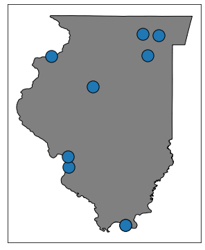
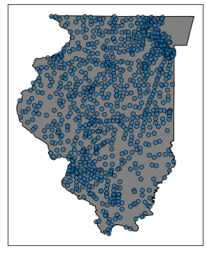

# Illinois Gambling Analysis
> Using Hierarchical Linear Modeling to infer the relationship between video gambling terminals and casino tax revenue at the municipal level.

## Table of Contents
1. [Purpose](#Purpose)
2. [Background](#Background)
3. [Running the code](#Running-the-code)

# Purpose

In this project I use hierarchical linear models to evaluate the relationship between the number of video gambling terminals within a municipality and the public funds that result from casino revenue while controlling for differences in population between communities. By using hierarchical models, as opposed to the standard Ordinary Least Squares method, I am able to infer the average impact that terminal count has on resulting tax revenue, and the variance that can be expected across communities. 

## Background

Video gambling was legalized by the state of Illinois in 2009, with the first machines activated in September of 2012. Since then the number of towns that have installed video gambling machines has increased every year.
> **Note:** All video gambling activities were suspended from April 2020-June 2020 to mitigate transmission of COVID19. While data for 2020 has been reported by the [Illinois Gaming Board](https://www.igb.illinois.gov/) these data require further clarification by the Illinois Gaming Board before they can be confidently analyzed. Because of this, 2020 data  is largely excluded from this analysis and excluded entirely from the models developed in this notebook. 

**Prior to the legalization of video gambling**, if an Illinois residents had wanted to gamble their only option was to travel to one of the few municipalities home to a casino.

**However**, since activation of video gambling in 2012, access to gambling facilities have become widely distributed throughout the state.

During this same time, **Illinois has also seen a near consistent decline in casino revenue.**

Given the growth that has occurred for video gambling products, increased scrutiny was likely inevitable, but due to the decline in Casino revenue, the differing tax rates between video and casino gambling havee been frequently debated by journalists, voters, and legislators.

### Tax Breakdown

**TLDR;**
> **Casino gambling tax rates increase as revenue increases. The tax rate for video gambling is fixed.**

"*Wagering Tax Effective July 1, 2020, the wagering tax is as follows:*

<u><i>All gambling games, other than table games:</i></u>
- *15% of AGR up to and including \$25 million*
- *22.5\% of AGR in excess of 25 million but not exceeding 50 million*
- *27.5\% of AGR in excess of 50 million but not exceeding 75 million*
- *32.5\% of AGR in excess of 75 million but not exceeding 100 million*
- *37.5\% of AGR in excess of 100 million but not exceeding 150 million*
- *45\% of AGR in excess of 150 million but not exceeding 200 million*
- *50\% of AGR in excess of 200 million

<u><i>All table games:</i></u>
- *15\% of AGR up to and including 25 million*
- *20\% of AGR in excess of 25 million"*

> - [Illinois Gaming Board](https://www.igb.illinois.gov/CasinoFAQ.aspx#:~:text=The\%20Illinois%20Gambling%20Act%20imposes,and\%20a%20tax%20on%20admissions.&text=The\%20admissions%20tax%20was%20increased,person\%20to%20%243%20a%20person.)

Ultimately, the debate tends to go as followed:

Person A: "Video gambling is cutting into casino revenue, and casino revenue is taxed at a greater rate than video gambling so video gambling is bad for my community."

Person B: "Video gambling has a fixed tax rate, but casino gambling is frequently taxed at half the rate of video gambling, so video gambling is good for my community."

While it is true that casino revenue is in decline, in the case of tax rates higher than that of video gambling, this decline has been consistent since 2003. Because the first video gambling terminals did not go live until 2012, it is not accurate to say the introduction of video gambling is the sole driver of the decline in higher tax payments from casinos.

This however is neither evidence in support or against the suggestion that video gambling leads to less public funds. **So does it?** To determine this we must ask ourselves, *what is the relationship between video gambling and casino tax revenue? On average, what happens to casino tax revenue when new video gambling terminals are introduced to a community?*

These are questions for which linear regression is well suited. But for this problem OLS which assumes independence across observation would ignore the inherent correlation that exists within municipalities. The mean and standard deviations of terminal counts and tax revenue in one municipality are likely to differ drastically from municipalities with higher populations. For this reason, I will use multi level linear regression which controls for intercluster correlation and allows the adding of random intercepts and slopes for relevant parameters. Ultimately this gives me the ability to account for multiple stratifications of dependence within my model.

## The data

The data for this project consists of casino and video gambling monthly reports and census data that was collected for each municipality using the 5 Year American Community Survey (ACS). The monthly reports were collected with a selenium web scraper and all data was inserted into a postgresql `illinois_gambling` database. 

The source code for data collection can be found [here](src/)

**For a full overview of the modeling process, please review the [MVP (minumum viable product) Notebook](notebooks/mvp.ipynb)**

## Final Model Interpretation

This model finds that on average a 1 standard deviation increase in the number of video gambling terminals will result in a 5% decline in casino revenue. If we consider the standard deviation and mean across communities, this totals to a ≈\$380,172 decline in casino revenue for each video gambling terminal. 

Checking the assumptions for multi level models, was found to be non trivial, and largly unsupported by the tools in the statsmodels.diagnostics module. Customized/revised modeling tools were developed for this project in order to assess the assumptions of linear regression, see [Modeling.py](src/Modeling.py). In its current form, this model is violating the assumptions of homoscedasticity and linearity (p < 0.05) but presents a notable improvement on the homoscedasticity assumption based on visul inspection of residuals. Because of these violations, it is reasonable to believe that the $380,172 number is biased. Additionally, given the significant differences in magnitidute of gambling revenue between communities, using a generalized standard deviation and mean are ill advised for this problem.

# Counter Factual Analysis
The $380,000 number is likely inflated. Let's take the relationship contained without our terminal_count coefficient and calculate the counter factual revenue that, according to our model, a casino would have received if video gambling had not been present, and instead apply the community level  mean and standard deviation.

### Running the code

#### Virtual Environment

To ensure you have all required packages for this notebook, an environment.yml file has been provided [here]().
Follow the set-up instructions [here]() to create and activate the environment.

------

#### Data Collection

The code used for collecting the gambling data can be found [here]()

The code used for collecting census variables can be found [here]()

------

